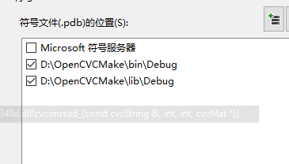

这篇文章主要记述了在VS2017中实现OpenCV源码级调试。

<!--more-->

## 在VS2017中实现OpenCV源码级调试

0.需要把`opencv`的源码路径加上，在`配置属性->vc++目录->源目录`，`C:\Program Files\opencv\sources\modules`

1.`cmake`编译`opencv`源码，如果是`OpenCV3.0`以上版本可以勾选`Build OpenCV_World`选项，这样可以使得编译的最终结果是一个总的`dll`等文件，省的一个一个`dll`文件添加了。然后打开`opencv.sln`，`Debug`，`release`下都`build`一遍。这时会出现`bin`文件，`lib`文件，以及`install`文件：`bin文件`你会发现有了`dll`，还有`pdb`文件，一一对应，`lib`文件同样也多了`exp`文件；
而install文件你会发现和一键安装opencv时生成的文件一样， 有lib include bin；

2.打开`工具->选项->调试->符号`，在`Microsoft`符号服务器下右上角有个添加，我输入`opencv_world340d.pdb`，然后运行，看输出窗口还是提示说 无法查找或打开 `PDB `文件，，又发现右上角是文件夹的新建,接着把debug的pdb路径输入，在运行程序加断点，完美，输出窗口 

3.在opencv自带函数处加断点，F11，哇，cvLoadImage(), 调到opencv的src文件内的`d:\opencv340\opencv\sources\modules\highgui\src\loadsave.cpp`，可以看到`oepncv`自带函数的实现了，点云库`PCL`想看源码，也一样

- debug下，F11单步执行才可以进入opencv源码的cpp.

> 之前怎么也不成功是因为生成的Opencv_world340d.dll不对，正经生成出来的是150M

## OpencvCmake

- 如果根据上面设置之后，编译还会有同样的错误，可以直接注释发生错误的地方。 经过一番搜索之后，发现是因为vtk8.10之后的版本中将vtkMapper的ImmediateModeRenderingOff()方法移除了，所以为了让pcl1.9.1代码编译通过，只需要将错误提示中对应的那一行代码注释掉即可，或者更换为更低版本的vtk也行。我是通过注释掉上述出错的两行代码，因为ImmediateModeRenderingOff()方法不是必须的操作，最后通过了编译。
- libConfig++，注意生成的要是64位的Lib&DLL
- boost连接